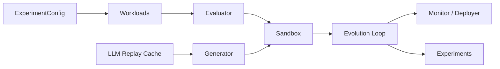

# cache-evolve

LLM-guided cache eviction policy evolution with deterministic simulation, replayable LLM outputs, and equal-budget baselines.

## Architecture



## Setup

```bash
python3 -m venv .venv
source .venv/bin/activate
pip install -r requirements.txt -e .
pytest -q
```

## Reproducible workflow

```bash
./scripts/reproduce.sh
```

- Simulator workloads and baselines are seeded via `ExperimentConfig.seed`.
- LLM calls are **not** re-run during replay: responses are keyed by prompt hash in `llm_replay_cache.json`.

## Run experiments

```bash
python scripts/run_experiment.py --config config.yaml --out results/run.json
```

- Fixed cost cap: `cost_cap_usd` in config.
- Equal evaluation budget across LLM / random / genetic (`evaluation_budget`); **every candidate evaluation counts**, including sandbox rejects.
- Fewer LLM seeds than baseline seeds is allowed when cost-limited.

## Security / sandbox

- AST validation blocks dangerous imports/names before execution.
- Policies run in a subprocess with wall/CPU/memory limits (**Linux-only** resource limits; not a real security boundary).

## Live deployment notes

- Default **cold start** on deploy (empty cache state).
- Rollback baseline: **shadow LRU** on the same live access window.
- **Belady** is offline-only (`belady_hit_rate`) and is not deployable online.

## Best evolved policy (default seed)

The seeded LLM replay returns an LRU-style `OrderedDict` policy — a sane baseline for end-to-end tests; evolution search can improve on scan-heavy replay windows under the shared evaluation budget.
